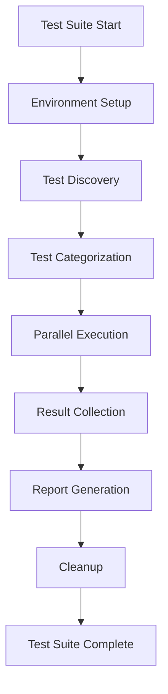

# Testing Framework Overview

## Introduction

The DupFinder Testing Suite is a comprehensive, multi-layered testing framework designed to ensure code quality, prevent regressions, and validate user experience across all supported platforms.

## Architecture

### Testing Pyramid

Our testing strategy follows the testing pyramid principle:

```
    ┌─────────────────────┐
    │   E2E Tests (10%)   │  ← Slow, expensive, high-level
    ├─────────────────────┤
    │ Integration (20%)   │  ← Medium speed, component interaction
    ├─────────────────────┤
    │  Unit Tests (70%)   │  ← Fast, isolated, component-level
    └─────────────────────┘
```

### Core Components

#### 1. Test Infrastructure (`tests/framework/`)
- **TestHarness**: Central test execution and coordination
- **TestEnvironment**: Test data and environment management  
- **TestReporting**: Comprehensive reporting and metrics
- **TestUtilities**: Common testing utilities and helpers

#### 2. Test Categories

##### Unit Tests (`tests/unit/`)
- Component-level testing
- Business logic validation
- Algorithm correctness
- Edge case handling

##### Integration Tests (`tests/integration/`)
- Component interaction validation
- Data flow verification
- API contract testing
- Cross-component communication

##### UI Tests (`tests/ui_automation.*`)
- User interface automation
- Visual regression testing
- Accessibility validation
- Theme consistency

##### End-to-End Tests (`tests/workflow_testing.*`)
- Complete user workflows
- Real-world scenarios
- Cross-platform behavior
- Error recovery testing

##### Performance Tests (`tests/performance/`)
- Benchmark execution
- Memory leak detection
- Load and stress testing
- Performance regression detection

## Key Features

### 1. Multi-Platform Support
- Windows, macOS, and Linux testing
- Platform-specific behavior validation
- Cross-platform consistency verification

### 2. Visual Testing
- Screenshot-based regression testing
- Baseline management
- Difference image generation
- Theme validation across all UI components

### 3. Performance Monitoring
- Automated benchmark execution
- Performance baseline comparison
- Memory usage tracking
- CPU utilization monitoring

### 4. Accessibility Testing
- Keyboard navigation validation
- Screen reader compatibility
- Color contrast verification
- ARIA compliance checking

### 5. CI/CD Integration
- Automated test execution on commits
- Pull request validation
- Nightly comprehensive testing
- Quality gate enforcement

## Test Execution Flow



### Execution Phases

1. **Environment Setup**: Initialize test environment, create test data
2. **Test Discovery**: Scan for available tests, apply filters
3. **Test Categorization**: Group tests by type and dependencies
4. **Parallel Execution**: Run tests concurrently where possible
5. **Result Collection**: Aggregate results, capture artifacts
6. **Report Generation**: Create HTML reports, coverage analysis
7. **Cleanup**: Clean up test data, reset environment

## Configuration

### Test Suite Configuration
Tests are configured via `test_config.json`:

```json
{
  "execution": {
    "parallel": true,
    "maxThreads": 4,
    "timeout": 300
  },
  "categories": {
    "unit": { "enabled": true, "timeout": 30 },
    "integration": { "enabled": true, "timeout": 120 },
    "ui": { "enabled": true, "timeout": 180 },
    "performance": { "enabled": false, "timeout": 600 }
  },
  "reporting": {
    "html": true,
    "junit": true,
    "coverage": true,
    "screenshots": true
  }
}
```

### Environment Variables
- `DUPFINDER_TEST_DATA_DIR`: Test data directory
- `DUPFINDER_TEST_TIMEOUT`: Global test timeout
- `DUPFINDER_TEST_PARALLEL`: Enable parallel execution
- `DUPFINDER_TEST_VERBOSE`: Enable verbose logging

## Quality Metrics

### Coverage Targets
- **Unit Tests**: 85% line coverage minimum
- **Integration Tests**: 70% component interaction coverage
- **UI Tests**: 90% user workflow coverage
- **Overall**: 80% combined coverage

### Performance Targets
- **Test Suite Execution**: < 30 minutes complete suite
- **Unit Test Speed**: < 1 second per test average
- **Integration Test Speed**: < 10 seconds per test average
- **Test Reliability**: < 2% flaky test rate

## Best Practices

### Test Organization
- Group related tests in the same file
- Use descriptive test names
- Follow naming conventions
- Maintain test independence

### Test Data Management
- Use test-specific data directories
- Clean up after each test
- Use realistic but minimal data sets
- Avoid hardcoded paths

### Error Handling
- Provide clear failure messages
- Capture relevant context on failure
- Use appropriate assertion methods
- Handle timeouts gracefully

## Next Steps

- Read the [Test Writing Guidelines](test-writing-guidelines.md)
- Explore [Test Examples](examples/)
- Check the [API Reference](api/)
- Review [Troubleshooting Guide](troubleshooting.md)